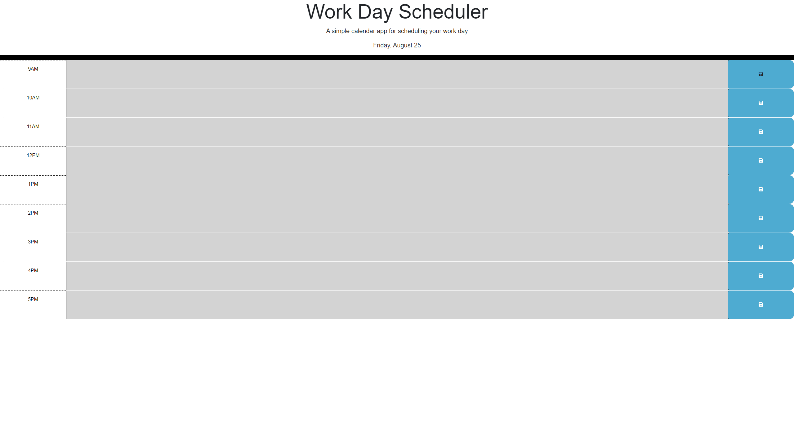

# Scheduling Calendar

## A dynamically updated calendar to store events

## Description 

- The key motivator for this webpage was to create a convient and reliable way to stay organized and keep track of all the events to be done on that day

- This webpage includes a header that displays the current date in, (Day of the week, Month Day) format, and has a time-block of 9am-5pm that can be edited and will save input from the user that will remain on the webpage even when refreshed

- My webpage will effortlessly save events the user inputs and will remain even if you tab out of the browser allowing user's to organize a schedule efficiently 

- During the development of this webpage I was able to learn more about and apply local storage saving to the application and how to dyanmically update the current day using day.js()

## Usage 

https://kimkristion.github.io/Scheduling-Calendar/

## Credits

- Starting Code provided by
https://github.com/coding-boot-camp/crispy-octo-meme/tree/main/Develop

## License 

- Please refer to LICENSE in the repository